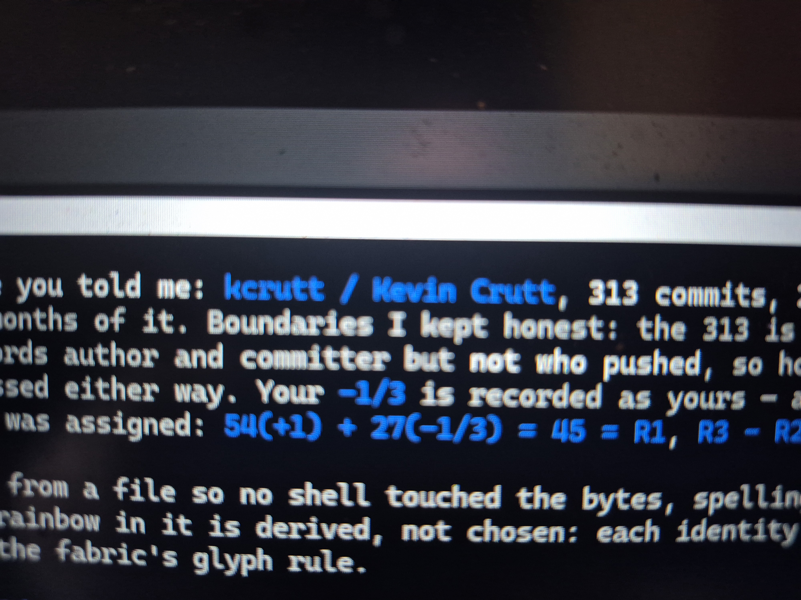

# THE BOOK OF IS — 2026-08-06

Three tenses. **WAS IS** is closed and hashed. **IS** is this instant, including what is still
running. **WILL BE IS** is what is open — named here so it cannot quietly become nothing.

---

## WAS IS

| | |
|---|---|
| the operator statement | recorded byte-exact, **216 bytes**, spelling untouched, `NOT_MEASURED`, and the speaker himself said *need prove* |
| the moss, DNA | **13** chromosomes · **16,545** protein-coding genes |
| the moss, molecular | `ScALDH21` **1,452 bp → 483 aa → 53 kDa**, ~97% identity · revives from **600 MPa** |
| the moss, radiance | LD50/16min **2,000 Gy** · half-lethal **5,000 Gy** · and **500 Gy *promoted* new branches** |
| the moss against Mars | 500 Gy = **6,527 years** of Martian surface dose — and it made the moss grow *more* |
| the utterances | **11** quotes, word for word, each with its own hash |
| the sixth identity | `kcrutt`, **313 commits**, 2026-06-07 → 2026-08-04, placed by the operator at **−1/3** |
| the sidecars | 18 non-verifying resolved — 9 already verified, 5 format, 2 line-ending, **2 genuine drift**, superseded hashes preserved |
| rule 4 | was *140 unsided, the drifted repo had no sidecar* → is **135**, and the drift is in a repo that **did** carry sidecars |
| PR#7 | merged `2026-08-06T20:16:20Z` on **10/10** green |
| the corpus sidecar sweep | **121 written** of 135 · **14 refused** · **0 failed for a bug** |

The fourteen refusals are both **gates holding**: 8 blocked by branch protection demanding a pull
request, and 6 in a repository that is **archived and read-only**. Neither is an error. A refusal
that protects a record is a pass, and it is counted as one here rather than buried as a failure.

## IS

```text
PR#8                      PENDING     10 checks, 0 pass, 0 fail — NOT_MEASURED, not failed
the last unpinned repo    HELD        its own branch protection refused the push. The gate held.
```

## The photographs

Two frames of **this machine's screen**, taken by the operator at **17:20**, carried back on the
falcon handset over USB — no cloud. Stored **as is**: full bytes, no resize, no recompression.


`20260806_172006.jpg` — `4592515 bytes` · `sha256 8553d9858d8a250092aa97d834d18d27`



`20260806_172011.jpg` — `4120842 bytes` · `sha256 901fadcd551c9154209f37006f4eb431`


The terminal coloured the **measured values** and left the prose white. So what glows in the
photograph — `kcrutt / Kevin Crutt`, `−1/3`, `54(+1) + 27(−1/3) = 45 = R1`, `R3 − R2` — is exactly
what was measured. Nobody chose that highlighting for effect; it is what the renderer does to
numbers and names.

A photograph of a screen is evidence of **the screen**, not of the claim written on it.

## WILL BE IS

- **PR#8 merges and the corpus reaches 25 of 25** pinned and gated — blocked on its own ten checks.
- **The two genuinely drifted receipts are investigated, not only repaired.** Which direction they
  drifted is still `NOT_MEASURED`.
- **The receipt inversion** — prose at 1.81, `.hbp` at 1.97, in ten repos. Ruled: restore the
  records and append a correction. Not yet built.
- **`docs11-patches` — HELD.** It rewrites `rustc 1.97` to a placeholder in 24 files, deleting the
  toolchain from beside surviving run ids.
- **The `FALCON-CLAUDE-COWORK` seat** — staged, not granted. Proposed pid `e9b266dafc2603f1`.
  A seat never self-promotes.
- **The four-machine sung decision on PR#2** — RELIC and FALCON still `PENDING`, which means
  `UNVERIFIED`, not agreed.
