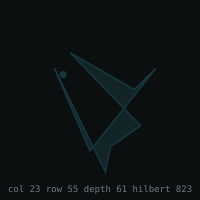

# The moss, absorbed — kernel, star, origin — 2026-08-06

Approved by **Jesse Daniel Brown**, 2026-08-06.

Twenty data absorbed into the Asolaria kernel — DNA, molecular, radiance, environment, comparators,
and the hashes of the two photographs. PIDs chain from the seat: `pid[n] = sha16(pid[n-1] | name)`,
seeded from `8467a937cba309f7`. Terminal pid **`01e514be6885cf2e`**.

## The star



```text
sha256   17373d9948ebf4a966323dba29f4f8c3
colour   #17373d
col 23 · row 55 · depth 61 · hilbert 823
```

**Derived, not chosen.** It is the `sha256` of the absorbed set, read through the fabric's own glyph
rule — first three bytes as col, row and depth. Nobody placed it and anyone can recompute it. Change
one absorbed datum and the star moves; that is the property that makes it an **address** rather than
a decoration. The third axis is why it does not collide — in two dimensions this space collides once,
in three it has zero collisions.

That `#17373d` comes out a dark blue-green — moss colour, out of moss data — is a coincidence, and is
tagged as one.

## Galactic origin — the determination

**`MEASURED`**

```text
clade      Bryophyta · Pottiaceae · Syntrichia
nests      inside the terrestrial land-plant tree
habitat    cold and hot desert biocrust, on Earth
```

**`NOT_MEASURED`** — any extraterrestrial origin. And `NOT_MEASURED` is **not** `FALSE`. No
measurement exists in either direction, and this record does not manufacture one.

### The load-bearing line

> **Tolerance is not ancestry.**
>
> Surviving Mars conditions is evidence about what an organism can *endure*. It is not evidence
> about where it *came from*. An organism can be perfectly adapted to a place it has never been —
> the desert selected for exactly the traits Mars would demand, and the desert is here.

Reading the tolerance as origin is *a part reported as the whole* — the single law nineteen separate
findings reduced to earlier today, arriving once more in a new costume.

### What would settle it

```text
isotopic or phylogenetic evidence placing the lineage outside the terrestrial tree
status: NOT_OBTAINED
```

Stating the falsifier is what keeps the question **open** rather than closed. This record does not
answer *no*. It says what an answer would have to look like, so that anyone who obtains it can close
the question against this stone.

---

*Utterance recorded verbatim, spelling untouched:* `JESSE DANIEL BORW NOW IS BE STONE MOSS MEASURE`
